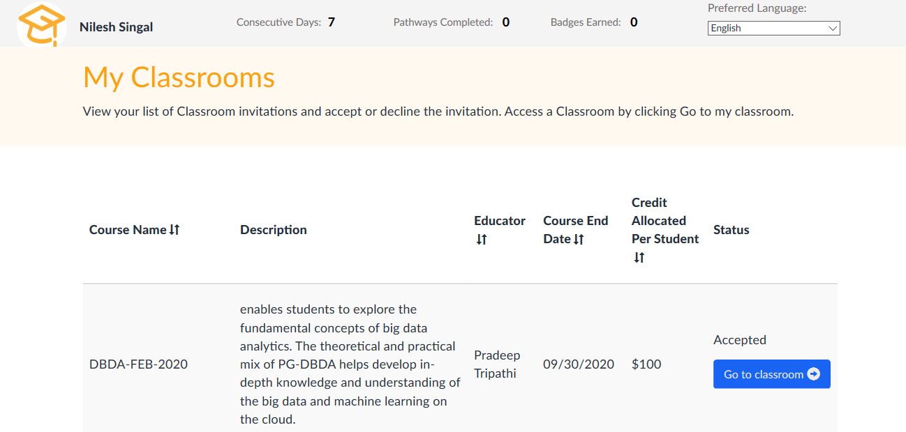
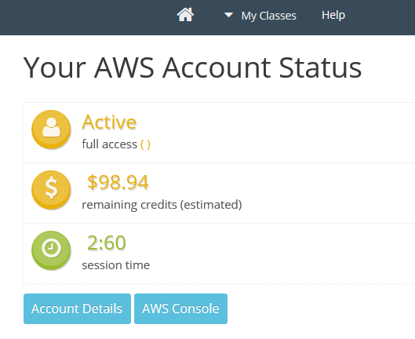
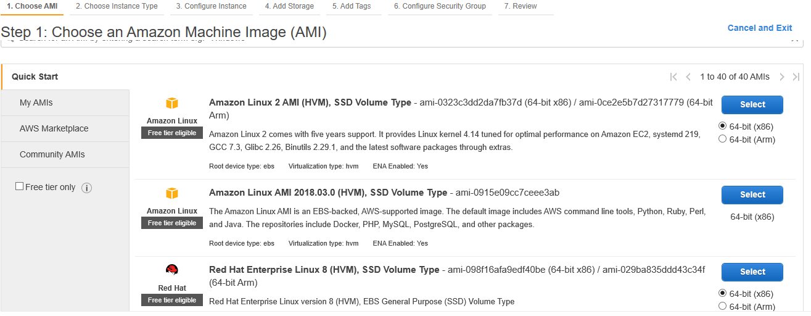

## Amazon Elastic Compute Cloud (Amazon EC2) 
is a web service that provides secure, resizable compute capacity in the cloud.
It is designed to make web-scale cloud computing easier for developers.
Amazon EC2’s simple web service interface allows you to obtain and configure capacity with minimal friction.
It provides you with complete control of your computing resources and lets you run on Amazon’s proven computing environment.

## Reliable, Scalable, Infrastructure On Demand

* Increase or decrease capacity within minutes, not hours or days
* SLA commitment of 99.99% availability for each Amazon EC2 region.
  Each region consists of at least 3 availability zones
* The AWS Region/AZ model has been recognized by Gartner as the recommended 
  approach for running enterprise applications that require high availability
  
 # How to Create an EC2 Instance for AWS.
 The process for creating an EC2 instance when using AWS can become quite complex. 
 You can manually create key pairs used to log in to the instance, 
 for example, or create a special security group to help maintain EC2 security.
 In addition, you can use a custom AMI to configure your instance. 
 The problem is that all these extra steps make what should be a relatively 
 simple process for experimentation purposes quite difficult.
 
 ## How to Create EC2 Instance in AWS: Step by Step Tutorial 
 
 ## 1. *Login and access to AWS services*
 
 
 
 ## 2. *After sucessfull login go to your classroom*
 
 
 
 ## 3. *Then Go to AWS CONSOLE*
 
 
 
 
 ## 4. *Go To Services* 
 
 
 
 ## 5. *Select First Option EC2*
 
 
 
 ## 6. *Now Launch Instance*
 
 
 
 ## 7. Step 1: Choose an Amazon Machine Image (AMI)
 
 You can search for required **Operating System**, In This Demo we will create instance of Linux
 select the first option **Amazon Linux 2 AMI (HVM), SSD Volume Type**
 
 
 

 

 
 
